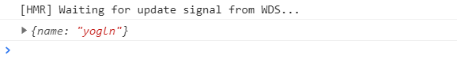
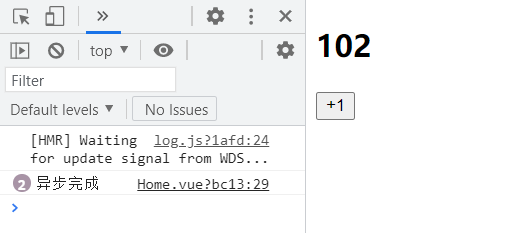

# 一、state

## 1.optionsAPI获取组件状态的3种方式

- 原始方式

  ```js
  this.$store.state.counter
  ```

- 计算属性方式

  ```js
    computed: {
      name() {
        return this.$store.state.name
      }
    },
  ```

- `mapState`辅助函数的方式

  数组方式

  ```js
  computed: {
  	...mapState(['name', 'age'])
  },
  ```

  对象方式

  ```js
  ...mapState({
    sName: state => state.name,
    sage: state => state.age
  })
  ```

## 2.setup中的使用

- 方式一：

  ```js
  const store = useStore()
  const name = computed(() => store.state.name)
  return {
    name
  }
  ```

- 方式二：

  ```js
  const store = useStore()
  const storeStateFns = mapState(['name', 'age'])
  // name: function , age: function
  const storeState = {}
  Object.keys(storeStateFns).forEach(fnKey => {
    // console.log(fnKey); // name age
    const fn = storeStateFns[fnKey].bind({ $store: store })
    storeState[fnKey] = computed(fn)
  })
  return {
   ...storeState
  }
  ```

- 方式三：

  对上面方式二进行封装，`hooks/useState.js`

  ```js
  import { computed } from 'vue';
  import { mapState, useStore } from 'vuex';
  
  export default function(mapper) {
    const store = useStore();
    const storeStateFns = mapState(mapper);
    // name: function , age: function
  
    const storeState = {};
    Object.keys(storeStateFns).forEach((fnKey) => {
      // console.log(fnKey); // name age
      const fn = storeStateFns[fnKey].bind({ $store: store });
      storeState[fnKey] = computed(fn);
    });
    return storeState;
  }
  ```

  使用：

  ```js
  const state = useState(['name', 'age'])
  
  return {
    ...state
  }
  // 对象也可以的
  const state = useState({
      sName: state => state.name,
      sAge: state => state.age
  })
  ```

# 二、getters

## 1.getters的基本使用

```js
  getters: {    
      nameInfo(state) {      
          return `name: ${state.name}`;    
      },  
  }
```

```vue
<h2>{{$store.getters.nameInfo}}</h2>
```

当然， getters函数也可以有第二个参数`state`

```js
ageInfo(state, getters) {
    return getters.name + ` age: ${state.age}`;
}
```


## 2.getters的返回函数

```js
  getters: {    
      helloInfo(state) {      
          return (name) => {        
              return 'hello ' + name;      
          };    
      }  
  },
```

```vue
  <h2>{{$store.getters.helloInfo('yogln')}}</h2>
```

## 3.mapGetters辅助函数

### optionsAPI

```js
  computed: {    
      ...mapGetters(["nameInfo", "ageInfo"])  
  },
```

使用

```vue
  <h2>{{nameInfo}}</h2>  <h2>{{ageInfo}}</h2>
```

### setup使用

封装一个和mapState类似的一个钩子函数

`hooks/useGetters`

```js
import { computed } from 'vue';
import { mapGetters, useStore } from 'vuex';
export default function(mapper) {  
    const store = useStore();                                 
    const storeStateFns = mapGetters(mapper);  
    // name: function , age: function  const storeState = {};  
    Object.keys(storeStateFns).forEach((fnKey) => {    
        // console.log(fnKey); // name age    
        const fn = storeStateFns[fnKey].bind({ $store: store });    
        storeState[fnKey] = computed(fn);  
    });  
    return storeState;
}
```

使用

```js
  setup() {    
      const stateGetters = useGetters(["nameInfo", "ageInfo"])    
      return {      
          ...stateGetters    
      }  
  }
```

# 三、mutation

## 1.基本使用

```js
 mutations: {    
     increment(state) {      
         return state.counter++;                          
     },    
         decrement(state) { 
             return state.counter--;   
         }  
 },
```

```vue
<button @click="$store.commit('increment')">+1</button> 
<button @click="$store.commit('decrement')">-1</button>
```

## 2.mutation携带参数

实际中，`payload`多为一个对象

```js
addTen(state, payload) {      
    console.log(payload);      
    state.counter += payload;
}
```

使用

```vue
<button @click="$store.commit('addTen', 10)">+10</button>
```

另一种提交风格

```vue
  <button @click="addTen">+10</button>
```

```js
addTen() {      
    this.$store.commit({       
        type: 'addTen',        
        n: 10,        
        name: 'yogln'      
    })    
}
```

## 3.mapMutations辅助函数

```js
 ...mapMutations(["increment", "decrement", "addTen"])
```

```js
<button @click="increment">+1</button>  
<button @click="decrement">-1</button>  
<button @click="addTen({n: 10})">+10</button>
```

在setup函数中的使用也是一样的

```js
setup() {    
    const mutations = mapMutations(["increment", "decrement", "addTen"])    
    return {      ...mutations    }  
}
```

# 四、actions

Action类似于mutation，不同在于：

- Action提交的是mutation，而不是直接变更状态； 
- Action可以包含任意异步操作

这里有一个非常重要的参数context： 

- context是一个和store实例均有相同方法和属性的context对象； 
- 所以我们可以从其中获取到commit方法来提交一个mutation，或者通过 context.state 和 context.getters 来 获取 state 和 getters

## 1.基本使用

```js
actions: {    
    increamentAction(context) {      
        setTimeout(() => {        
            context.commit('increment');      
        }, 1000);    
    }  
}
```

`optionsAPI`使用

```js
increment() {  
    this.$store.dispatch("increamentAction")
}
```

也可以携带参数

```js
 increamentAction(context, payload) {  
     console.log(payload);  
     setTimeout(() => {    
         context.commit('increment');  
     }, 1000);
 }
```

```js
 increment() {      
     this.$store.dispatch("increamentAction", { name: 'yogln' })
 }
```



也可以这样

```js
this.$store.dispatch({	
    type: 'increamentAction',    
    name: 'yogln'
})
```

## 2.actions辅助函数

辅助函数也有两张写法：数组的写法和对象的写法

```js
const actions = mapActions(["increamentAction"])
const actions2 = mapActions({  add: "increamentAction"})
return {  
    ...state,  
    ...actions,  
    ...actions2,
}
```

使用

```vue
  <button @click="increamentAction">+1</button>
  <button @click="add">+1</button>
```

## 3.异步操作

Action 通常是异步的，那么如何知道 action 什么时候结束呢？ 我们可以通过让action返回Promise，在Promise的then中来处理完成后的操作；

```js
actions: {
    increamentAction(context) {
      return new Promise(function(resolve) {
        setTimeout(() => {
          context.commit('increment');
          resolve('异步完成');
        }, 1000);
      });
    }
  },
```

```js
const store = useStore()
const increment = () => {
      store.dispatch("increamentAction").then(res => {
        console.log(res);
      })
    }
```



# 五、modules

## 1.基本使用

Vuex 允许我们将 store 分割成模块（module）； 每个模块拥有自己的 state、mutation、action、getter、甚至是嵌套子模块。

我们在`store`新建一个文件夹`modules`

`home.js`

```js
export default {
  namespaced: true,
  state() {
    counter: 100;
  },
  getters: {},
  mutations: {
    increment(state) {
      state.counter++;
    }
  },
  actions: {}
};
```

在`sotre/index.js`

```js
  modules: {
    home
  }
```

## 2.state获取

```vue
<h2>Home: {{$store.state.home.homeCounter}}</h2>
```

## 3.getters获取

```vue
<h2>HomeGetter: {{$store.getters['home/doubleHomeCounter']}}</h2>
```

## 4.commit

```js
 methods: {
    homeIncrement() {
      this.$store.commit('home/increment')
    },
  },
```

## 5.actions

```js
 methods: {
    increamentAction() {
      this.$store.dispatch('home/increamentAction')
    }
  },
```

## 6.辅助函数的使用

### 写法一

```vue
<h2>Root: {{counter}}</h2>
<h2>Home: {{homeCounter}}</h2>
<h2>HomeGetter: {{doubleHomeCounter}}</h2>

<button @click="increment">root+1</button>
<button @click="increment">home+1</button>
<button @click="increamentAction">actions+1</button>
```


```js
computed: {
    ...mapState('home', ['homeCounter']),
    ...mapGetters('home', ['doubleHomeCounter'])
  },
  methods: {
    ...mapMutations('home', ['increment']),
    ...mapActions('home', ['increamentAction'])
  },
```

### 写法二

```js
import { createNamespacedHelpers } from 'vuex';
const { mapState, mapGetters, mapMutations, mapActions } = createNamespacedHelpers('home')

export default {
  computed: {
    ...mapState(['homeCounter']),
    ...mapGetters(['doubleHomeCounter'])
  },
  methods: {
    ...mapMutations(['increment']),
    ...mapActions(['increamentAction'])
  },
}
```

## 7.setup函数中的使用

我们需要对之前的封装的`useState`和`useGetters`进行再次的封装

`useMapper.js`

```js
import { computed } from 'vue';
import { useStore } from 'vuex';

export function useMapper(mapper, mapFn) {
  // 拿到store独享
  const store = useStore();

  // 获取到对应的对象的functions: {name: function, age: function}
  const storeStateFns = mapFn(mapper);

  // 对数据进行转换
  const storeState = {};
  Object.keys(storeStateFns).forEach((fnKey) => {
    const fn = storeStateFns[fnKey].bind({ $store: store });
    storeState[fnKey] = computed(fn);
  });

  return storeState;
}
```

`useState.js`

```js
import { createNamespacedHelpers, mapState } from 'vuex';
import { useMapper } from './useMapper';

export function useState(moduleName, mapper) {
  let mapperFn = mapState;
  if (typeof moduleName === 'string' && moduleName.length > 0) {
    mapperFn = createNamespacedHelpers(moduleName).mapState;
  }

  return useMapper(mapper, mapperFn);
}
```

使用

```js
setup() {
    const homeState = useState('home', ['homeCounter'])
    const homeGetters = useGetters('home', ['doubleHomeCounter'])

    const mutations = mapMutations(["increment"])
    const actions = mapActions(["incrementAction"])
    return {
      ...homeState,
      ...homeGetters,
      ...mutations,
      ...actions
    }
  }
```


